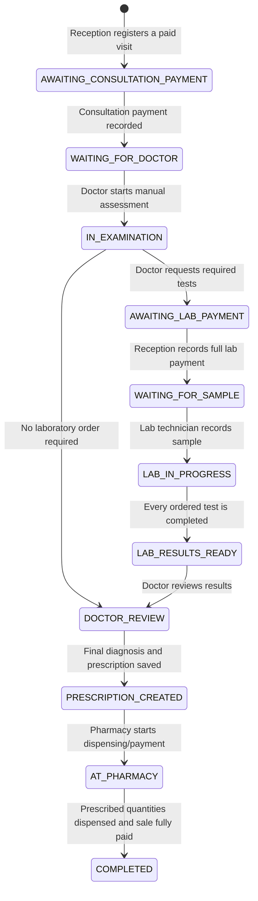

# PHMS clinical workflow

## Scope

PHMS now connects reception, clinical examination, laboratory, diagnosis, prescription, dispensing, and payment in one tenant- and branch-scoped patient visit. Existing pharmacy, stock, FEFO checkout, and finance behavior remains intact.

## Role boundaries

| Role | Working area |
|---|---|
| Owner / Admin | Configuration and controlled oversight across the tenant |
| Receptionist | Patient registration, doctor assignment, consultation payment, lab payment, and receipt printing |
| Doctor | Patient history, manual clinical assessment, lab ordering, diagnosis, prescription, and clinical printing |
| Lab technician | Paid lab queue, sample collection, typed result entry, interpretation, and result completion |
| Pharmacist | Prescription queue, medicine-to-product mapping, dispensing, stock-aware sale, and pharmacy payment |

General sales, expense, margin, and operational reports are not available to doctors. Every API action is also protected server-side by granular permissions; hiding a navigation item is not treated as authorization.

## Visit state machine

The service preserves legacy status values for old rows and clients while new actions use the canonical states above.

## Clinical record

The doctor enters all findings manually. The system stores, but does not infer:

- complaint, symptom list, onset/history and severity narrative;
- temperature, blood pressure, pulse, respiratory rate, oxygen saturation, weight, and height;
- past medical and surgical history, current medicines, and allergies;
- structured physical-examination sections and free clinical notes;
- provisional, differential, and final diagnoses as separate records.

A final diagnosis is blocked while an ordered lab test is incomplete. A prescription is blocked until an assessment exists and all requested tests are complete.

## Laboratory

Lab catalog entries support code, sample type, result type, unit, reference range, selectable options, and panel components. Result entry adapts to positive/negative, numeric, text, select, or panel tests. Interpretation is stored separately from the raw value. Sample collection and result entry are blocked until the lab fee is paid.

## Prescription and pharmacy

Prescriptions have a tenant-unique number and one or more manual items (medicine, strength, dose, route, frequency, duration, quantity, and instructions). A pharmacist maps an item to an inventory product/package during checkout. The sale, visit, prescription, and prescription item remain linked, including partial dispensing. Existing atomic FEFO stock deductions and payment handling remain the source of truth.

## Data isolation and audit

All new clinical tables use composite tenant foreign keys, PostgreSQL row-level security, and the restricted runtime database role. Branch access is checked before service operations. Consultation payments, assessments, lab orders, sample collection, results, diagnoses, prescriptions, dispensing, and sales emit audit records. Payment endpoints use idempotency keys.

## Main API surface

- `GET /api/v1/clinic/doctors?branchId=...`
- `POST /api/v1/clinic/visits`
- `POST /api/v1/clinic/visits/:id/consultation-payment`
- `PUT /api/v1/clinic/visits/:id/assessment`
- `POST /api/v1/clinic/visits/:id/lab-orders`
- `PUT /api/v1/clinic/visits/:id/diagnoses/:type`
- `PUT /api/v1/clinic/visits/:id/prescription`
- `GET /api/v1/clinic/prescriptions?branchId=...`
- `POST /api/v1/clinic/visits/:id/lab/:labVisitId/sample`
- Lab catalog, lab payment, result, and sales checkout endpoints retain their existing base paths with the expanded payloads.

## Migration and verification

Migration `202608210023_clinical_workflow_expansion` is additive. It backfills patient, lab-test, and prescription numbers; creates clinical assessment, diagnosis, and clinical payment tables; adds typed lab result metadata; and links prescriptions to sales. It temporarily relaxes forced RLS only while the schema owner performs deterministic backfills, then re-enables forced RLS in the same transaction.

Run migrations with the configured owner/migrator connection. Run the application with the restricted `phms_app` connection.